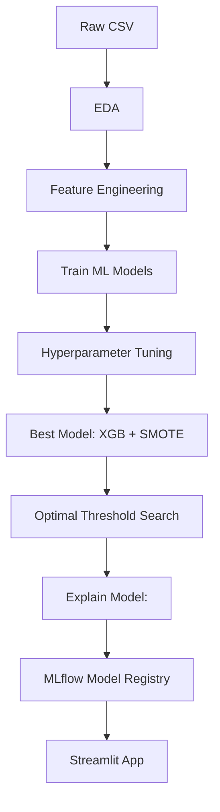

# Machine Learning Based Credit‑Card Fraud Detection

> **Goal:** Use a raw, **highly-imbalanced** credit-card transactions dataset to build an **explainable, cost-sensitive ML model** that *directly* optimizes **profit** and lets stakeholders explore trade-offs in real time.
>
> **Business Scenario:** A third-party fraud-detection company partners with multiple European card-issuing banks.
> • It earns a **success fee** (e.g. 10 % of the fraud amount) for every fraudulent transaction it blocks.
> • If it **misses fraud** (FN), the bank and vendor share the loss.
> • If it **wrongly blocks** a legitimate purchase (FP), the vendor pays the **review / customer-service cost** (≈ $3).
>
> The model must therefore **maximize net profit**-not just accuracy-under realistic business incentives.
> An interactive dashboard **simulates these financial trade-offs** across ~ 83 billion yearly EU card transactions.

---

## 0 Project Workflow Outline


---

## 1 Plan → Execution

| Stage | Artefact | Key Choices & Rationale |
|-------------------------------------|----------------------------------------------------|-------------------------|
| **Problem Framing** | whiteboard → custom `profit function` | Model should **maximize net profit**, not accuracy; defined a business-driven profit function with TP/FP/FN profits/costs |
| **EDA** | `notebooks/EDA.ipynb` | Verified 0.17% fraud rate; used PCA to confirm separability; confirmed `V` features are PCA axes |
| **Feature Engineering** | `notebooks/Feature_Engineering.ipynb` | Created `LogAmount` from skewed `Amount`; scaled `Time`; kept `V1-V28` unchanged for interpretability |
| **Model Selection** | `notebooks/Modeling.ipynb` | XGBoost chosen for highest Recall with least Precesion tradeoff, PR-AUC & speed; outperformed Random Forest and MLP baselines |
| **Handling Imbalance** | `notebooks/Hyperparameter_Tuning_XGB_SMOTE.ipynb` | Applied SMOTE to training folds; improved recall and PR-AUC with minimal precision loss |
| **Hyperparameter Tuning** | `notebooks/Hyperparameter_Tuning_XGB.ipynb` | Used Optuna (50 trials); tuned `n_estimators`, `max_depth`, `learning_rate`, `scale_pos_weight`, along with other less impactful parameters |
| **Threshold Tuning** | `notebooks/Threshold_Tuning.ipynb` | Usually a probability of 0.5 is considered a decision for a classification model where anything above **0.5** is labeled fraud. Tested thresholds τ from 0 to 1 to find the one that **maximizes business profit** based on fraud detection rewards and penalties. This tuning increased profit by **\$39 per 56k transactions** compared to using 0.5. |
| **Explainability** | `notebooks/Model_Explainability.ipynb` | Used **SHAP** (global + force plots) to globally explain model predictions (i.e most important features)|
| **Final Outcome** | `src/streamlit_app.py` | Dashboard with slider-adjustable profit assumptions, LIME plots for ; <30ms latency with real time infernece|
| **Experiment Tracking** | `mlruns/` | All metrics, parameters, models, and artifacts logged with MLflow |

---

## 2 Outcomes

| KPI (hold‑out test) | Value |
|---------------------------------------|-------------------------------|
| ROC‑AUC | **0.979** |
| **PR‑AUC** | **0.880** |
| F1 Score | **0.79** |
| **Precision** | **0.77** |
| **Recall (Sensitivity)** | **0.81** |
| Profit uplift (τ = optimal vs 0.5) | **+ $39 / 56k transactions** |
| Optimal threshold (τ) | **0.375** (at 25% FN penalty) |
| Median inference latency | **4.7 ms** on 1 vCPU |

The Streamlit dashboard turns these metrics into **annual profit simulations** across ~83 billion EU transactions, allowing stakeholders to adjust assumptions and immediately see financial impact using interactive sliders.

---

## 3 Decisions & Trade‑offs

* **Why XGBoost over other models?**
- Outperformed Random Forest and MLP in PR‑AUC and Recall-Precision tradeoff.
- Built-in support for imbalanced data via `scale_pos_weight`.
- Low latency inference makes it suitable for real-time deployment.

* **Why SMOTE instead of just class weights?**
- SMOTE increased recall and F1 without significantly increasing false positives.
- Applied only on training folds to prevent data leakage.

* **Why tune threshold τ instead of using default 0.5?**
- Fraud detection is a **cost-sensitive** task.
- Default 0.5 cutoff may not be optimal when FN and FP have unequal costs.
- Tuning τ directly **maximizes business profit** under any cost assumptions.

* **Why include both SHAP and LIME?**
- **SHAP**: explains overall model behavior and individual feature contributions.
- **LIME**: generates fast, intuitive local explanations inside the dashboard.

---

## 4 Real‑World Fit

* Designed to simulate how a **card issuer** or **fraud analytics team** might evaluate ML-driven decision-making for fraud review queues.
* Optimized threshold (τ) can help teams balance fraud recovery with customer experience, without retraining the model.
* Dashboard makes **cost assumptions transparent** - stakeholders can explore profit trade-offs under different business scenarios.
* Framework could be adapted to other **tabular fraud tasks**, such as:
- Small-scale chargeback prediction
- Internal audit flagging systems
* Best suited for **offline & online analysis**, simulation, or augmentation of human decisions.

---

## 5 Assumptions & Limitations

| Area | Notes |
|-----------------------|-----------------------------------------------------------------------|
| **Dataset** | Based on 2013 anonymized European dataset - patterns may not reflect current fraud tactics. |
| **Imbalance handling**| SMOTE applied cautiously; only during training to avoid leakage, but can still distort rare patterns. |
| **Profit function** | Uses fixed costs/rewards for TP, FP, FN - real-world values vary across institutions and may change over time. |
| **Regulatory impact** | Does not model legal risks (e.g. GDPR), false positive churn, or operational review delays. |
| **Deployment scope** | Built for local simulation and dashboarding - not tested on live transaction pipelines. |

---

## 6 Quick‑start

```bash
# Requires Python ≥ 3.12
git clone https://github.com/sharkz0912/creditcard-fraud-detection.git
cd creditcard-fraud-detection
python -m venv .venv && source .venv/bin/activate # Windows: .venv\Scripts\activate
pip install -r requirements.txt

# (Optional) Pre-compute profit cache for faster slider response
python src/precompute_profit_cache.py
```
# Launch interactive dashboard
https://sharkz0912-creditcard-fraud-detection-srcstreamlit-app-akmm5i.streamlit.app/

---

## 7 Repo Map

```
.
├── data/ # Raw and processed dataset files
├── models/ # Trained model pickles
├── mlruns/ # MLflow tracking logs
├── notebooks/ # EDA, feature engineering, modeling, etc.
├── src/ # Streamlit app + supporting scripts
│ ├── precompute_profit_cache.py
│ └── streamlit_app.py
├── requirements.txt # Project dependencies
└── README.md # This file
```

---

## 8 Future Work

- Investigate deep-learning approaches (MLP, R-GAN) for subtle pattern capture.
- Add pytest coverage for profit function and data pipeline.
- Package with a Dockerfile + CI for reproducible deploys.
- Retrain on current data & add drift monitoring.
- Automate periodic threshold re-tuning as costs change.
- Prototype Kafka real-time inference & feedback loop for analyst overrides.
- Support multi-currency cost matrices for cross-border banks.

---

## 9 Contact & Dataset

**Contact:**
Name: Srikar Rairao
Email: `rairao.srikar@gmail.com`
Github: [https://github.com/sharkz0912](https://github.com/sharkz0912)
LinkedIn: [linkedin.com/in/srikar-rairao](https://linkedin.com/in/srikar-rairao)

**Dataset:**
All experiments are based on the [Kaggle Credit Card Fraud Detection dataset](https://www.kaggle.com/datasets/mlg-ulb/creditcardfraud), which contains anonymized European transactions from 2013 and a fraud rate of just **0.172%**.
License: **CC BY-NC 4.0**
